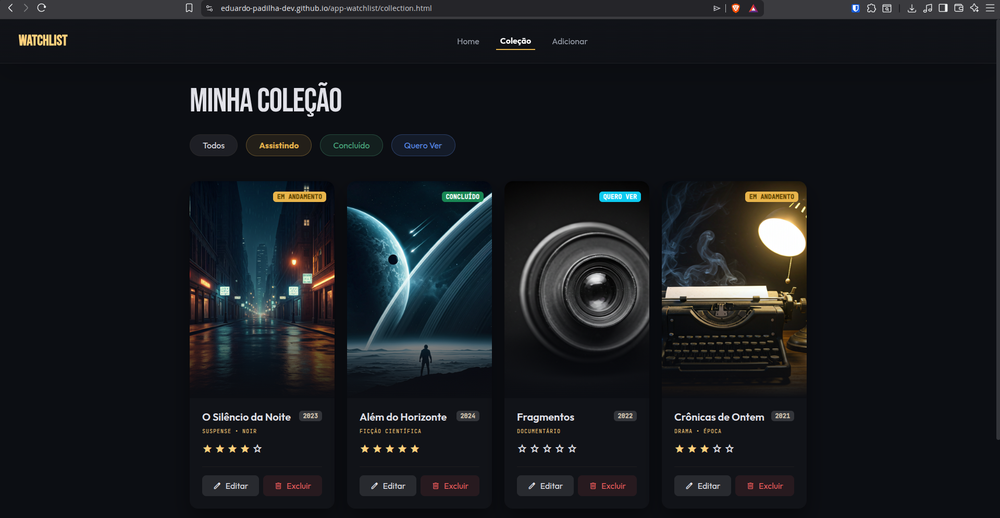
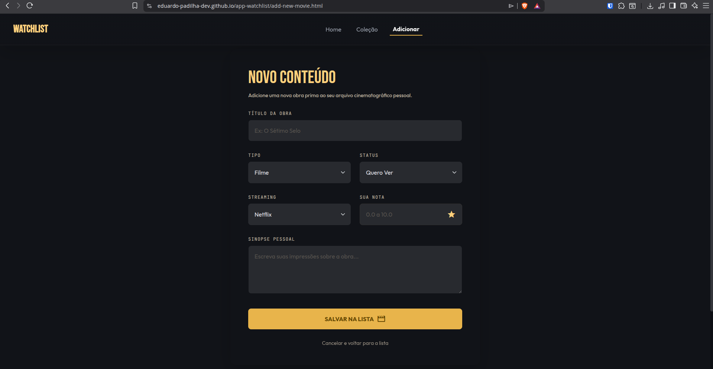

# 🎬 Watchlist — Gerenciador de Filmes e Séries

## 👤 Identificação / Autor

**Nome:** Eduardo Padilha do Nascimento
**RA:** a2598744
**Curso:** Sistemas para Internet
**Disciplina:** Desenvolvimento de Páginas Web com Framework e CSS
**Professor:** Dr. Roni Fabio Banaszewski

---

## 📋 Descrição do Projeto

O **Watchlist** é uma aplicação web para gerenciar filmes e séries que você deseja assistir, está assistindo ou já concluiu. O usuário pode buscar títulos via API pública (OMDb), adicionar à sua lista pessoal com informações como plataforma de streaming, status e nota, além de gerenciar sua coleção com edição e exclusão de registros.

---

## 🔗 Links

| Recurso                            | Link                                                       |
| ---------------------------------- | ---------------------------------------------------------- |
| 🎨 Protótipo no Stitch             | https://stitch.withgoogle.com/projects/1776335920136709795 |
| 🌐 Site em Produção (GitHub Pages) | _[link do GitHub Pages]_                                   |

---

## 🛠️ Tecnologias

- **Framework CSS:** Bootstrap 5
  - Escolhido pela documentação completa, sistema de grid responsivo de 12 colunas e componentes prontos como cards, modais e carousel — todos usados diretamente no projeto. O repositório oficial é ativamente mantido (MIT License).
- **API Pública:** OMDb API (https://www.omdbapi.com/)
  - Permite buscar informações reais de filmes e séries (pôster, título, ano, sinopse) pelo nome. Gratuita para até 1.000 requisições/dia, sem necessidade de OAuth.
- **Dependências JavaScript:**
  - jQuery
  - jQuery Mask Plugin
  - Fetch API (nativa)
  - JSON Server (API fake local)

---

## ✅ Checklist de Funcionalidades

### RA1 — Frameworks CSS e Layouts Responsivos

- [x] **ID 01** — Protótipo de interfaces mobile e desktop no Figma (ou Stitch)
- [x] **ID 02** — Layout responsivo com Bootstrap usando Flexbox/Grid do framework
- [x] **ID 03** — Layout responsivo com CSS puro usando Flexbox ou Grid Layout
- [x] **ID 04** — Uso de componentes prontos do Bootstrap (cards, buttons, modals, carousel)
- [x] **ID 05** — Layout fluido com unidades relativas (vw, vh, %, em, rem)
- [x] **ID 06** — Design System consistente aplicado em toda a aplicação (cores, tipografia, componentes)
- [x] **ID 07** — Uso de Sass (SCSS) com variáveis, mixins e funções
- [x] **ID 08** — Tipografia responsiva com media queries mobile-first ou função `clamp()`
- [x] **ID 09** — Responsividade de imagens com `object-fit` e containers com unidades relativas
- [x] **ID 10** — Otimização de imagens com formato WebP e carregamento adaptativo (`srcset` ou Cloudinary)

### RA2 — Formulários e Validações

- [ ] **ID 11** — Validação HTML nativa com campos obrigatórios, tipos e mensagens de erro/sucesso
- [ ] **ID 12** — Uso de expressões regulares (REGEX) para validações customizadas
- [ ] **ID 13** — Elementos de seleção em formulários (checkbox, radio, select)
- [ ] **ID 14** — Leitura e escrita no Web Storage (localStorage/sessionStorage)

### RA3 — Ferramentas de Desenvolvimento

- [x] **ID 15** — Ambiente configurado com Node.js e NPM
- [x] **ID 16** — Boas práticas de versionamento no Git/GitHub (branches, `.gitignore`)
- [x] **ID 17** — README.md padronizado conforme template da disciplina com checklist preenchido
- [x] **ID 18** — Arquivos do projeto organizados de forma modular
- [x] **ID 19** — Linters e formatadores configurados (ESLint, Prettier)

### RA4 — Bibliotecas JavaScript

- [x] **ID 20** — jQuery para manipulação do DOM e interatividade (eventos, animações)
- [x] **ID 21** — Plugin jQuery integrado e configurado (ex: jQuery Mask Plugin)

### RA5 — Requisições Assíncronas

- [ ] **ID 22** — Requisições assíncronas para API fake (JSON Server) para persistir dados do formulário
- [ ] **ID 23** — Requisições assíncronas para API fake (JSON Server) para exibir dados na página
- [ ] **ID 24** — Requisições assíncronas para API pública real (OMDb API), exibindo dados e tratando erros

---

## 📄 Páginas da Aplicação

| Página               | Descrição                                                      |
| -------------------- | -------------------------------------------------------------- |
| `index.html`         | Home — busca de filmes e séries via OMDb API                   |
| `collection.html`    | Listagem dos títulos cadastrados com filtros por status e tipo |
| `add-new-movie.html` | Formulário de cadastro e edição de títulos na lista            |

---

## ▶️ Instruções de Execução

### Pré-requisitos

- Node.js instalado ([nodejs.org](https://nodejs.org))
- NPM (incluso com Node.js)

### Passos

```bash
# 1. Clone o repositório
git clone https://github.com/eduardo-padilha-dev/app-watchlist.git
cd app-watchlist

# 2. Instale as dependências
npm install

# 3. Inicie o JSON Server (API fake)
npx json-server --watch db.json --port 3000

# 4. Abra o index.html no navegador
# (ou use a extensão Live Server no VS Code)
```

> **Nota:** O site em produção (GitHub Pages) utiliza apenas CDN para as dependências e a OMDb API. O JSON Server é necessário apenas para execução local.

---

## 🖼️ Telas da Aplicação

| Home                                       | Minha Lista                                      | Cadastro                                            |
| ------------------------------------------ | ------------------------------------------------ | --------------------------------------------------- |
|  |  |  |
